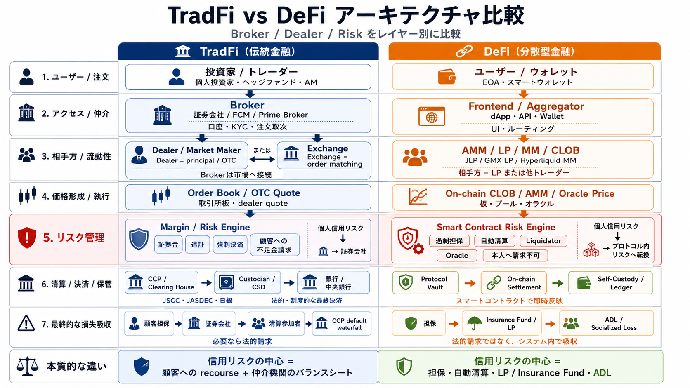
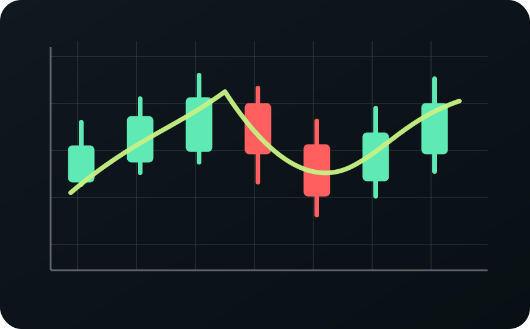
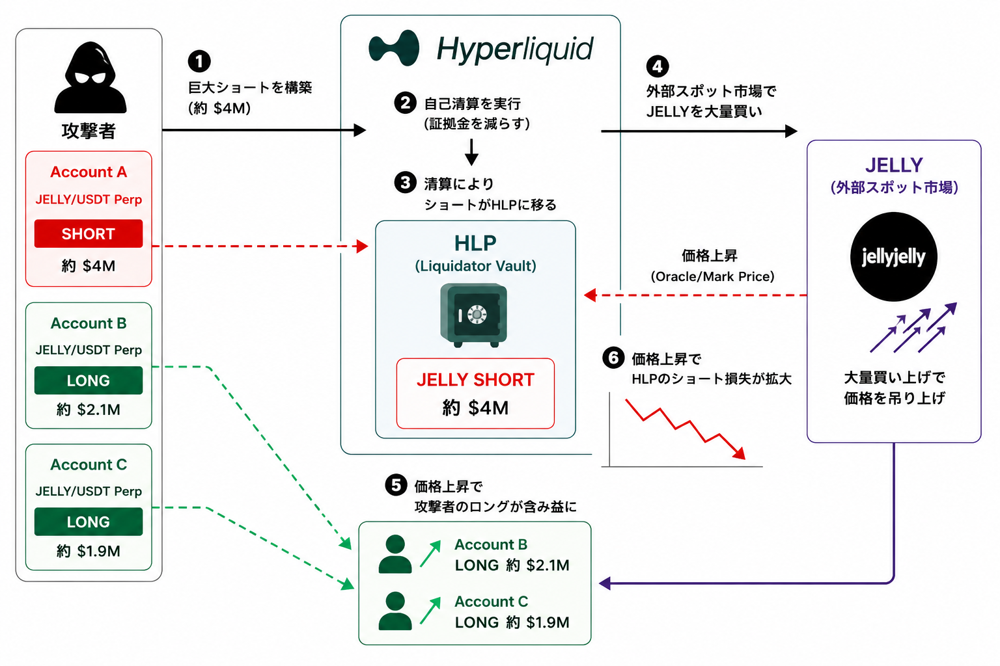

<!-- _class: lead -->

# 「ゼロから理解するDeFiトレード」

**AggregatorとPerpsの仕組み**

---

<!-- header: Opening -->

### 自己紹介

- Name: **asuma**
- Role: **Co-Founder / CTO [@DaikoAI](https://daiko.ai)**
- Links:
  - [posaune0423.com](https://posaune0423.com)
  - 𝕏: [@0xasuma_jp](https://x.com/0xasuma_jp)
  - Github: [@posaune0423](https://github.com/posaune0423)
  - Linkedin: [@posaune0423](https://linkedin.com/in/posaune0423)

---

<!-- _class: agenda-table -->

## 本日の流れ

| Section | Time   | 内容                             | 目的                                 |
| :------ | :----- | :------------------------------- | :----------------------------------- |
| 1       | 5 min  | Opening                          | 自己紹介と進行の共有                 |
| 2       | 15 min | Aggregator（SOR・ルート）        | 経路探索の直感                       |
| 3       | 5 min  | Jupiter Swap を見てみる          | Quote と Route の読み方              |
| 4       | 25 min | Perpetual（Oracle・DEX・リスク） | 用語と因果の整理                     |
| 5       | 8 min  | Demo（画面共有）                 | Jupiter・bulk trade などを実機で確認 |
| 6       | 2 min  | Closing                          | 参考リンク                           |
| Q&A     | 30 min | 質疑応答                         | —                                    |

---

<!-- _class: full-figure-slide -->
<!-- header: Opening -->

---

<!-- header: "" -->
<!-- _class: section-divider -->

# Part 1

## Aggregator

複数の DEX から最適なスワップ経路を探し、一つの画面や API で扱うレイヤー。

---

<!-- header: Aggregator -->

## 既存金融でいう SOR

**SOR（Smart Order Router）** に相当する発想。

Blockchain 上には DEX と呼ばれる取引所が沢山存在している。

それらを **1つの Interface** で呼べるようにしたもので、さらに最適な交換レートの
**route** を探索してくれる。

---

<!-- header: Aggregator -->

## 代表例

<h4>Jupiter</h4>

Solana でよく使われる入口の一例。

<h4>1inch</h4>

Ethereum 側でも名前が挙がりやすい一例。

---

<!-- header: Aggregator -->

## AMM 以外も束ねる

一般の AMM だけでなく、<strong>prop AMM</strong> や <strong>RFQ</strong> といった市場メーカーの見積もりも束ねて、ユーザーに実効レートの良い選択肢を出す。

既存金融でいえば、取引所の場内だけでなく <strong>立会外取引</strong> に近い流動性も混ざり得る、という理解。

---

<!-- header: Aggregator -->

## A. Direct Route

<pre><code>SOL -&gt; USDC</code></pre>

---

<!-- header: Aggregator -->

## B. Multi-hop Route

<pre><code>SOL -&gt; USDT -&gt; USDC
SOL -&gt; mSOL -&gt; USDC
SOL -&gt; JupSOL -&gt; USDC</code></pre>

---

<!-- header: Aggregator -->

## なぜ Multi-hop が起きる？

<h4>Direct</h4>

SOL/USDC のプールが薄いと、大口注文で価格が大きくずれる。

→

<h4>Multi-hop</h4>

SOL/USDT と USDT/USDC の方が厚ければ、経由した方が受け取り額が良いことがある。

Aggregator は「最短経路」ではなく、スリッページ込みで一番良い実行経路を探す。

---

<!-- header: Aggregator -->

## C. Split Route

Jupiter

Raydium

Meteora

Orca

<pre><code>SOL -&gt; USDC  40% via Jupiter
SOL -&gt; USDC  35% via Raydium
SOL -&gt; USDT -&gt; USDC 25% via Meteora + Orca</code></pre>

---

<!-- header: Aggregator -->

## なぜ Split Route が起きる？

<h4>1つのプールに全量</h4>

大口注文を一気に流すと、そのプールの価格カーブを深く進んでしまう。

<h4>複数プールへ分割</h4>

Raydium・Meteora・Orca などに分けると、各プールの価格インパクトを浅くできる。

40% Jupiter
35% Raydium
25% Meteora + Orca

大口取引ほど、分割した方が平均約定価格が良くなるケースが増える。

---

<!-- header: "" -->
<!-- _class: section-divider -->

# Demo

## 画面共有で Jupiter・bulk trade などを確認

---

<!-- header: "" -->
<!-- _class: section-divider -->

# Part 2

## Perpetual と、そのまわりの仕組み

---

<!-- header: Perpetual -->

## Perpetual とは？

**perp** = **Perpetual（永久）** ＋ **Future（先物）**

満期のない先物契約。<strong>証拠金・Funding・清算</strong>でポジションの状態が継続的に調整される。

---

<!-- header: Perpetual -->

## 「先物取引」とは？

将来の決まった日時・条件で、あらかじめ決めた価格で売買する約束を、<strong>いまの時点で</strong>取り交わす取引。

<h4>何をするか</h4>

「将来この価格で買う／売る」という<strong>契約</strong>を売買する。多くの市場で最終的には現物受け取りではなく、価格差の<strong>精算</strong>で決済される。

<h4>なぜあるか</h4>

農産物やエネルギーで生まれた「将来価格が読めない」リスクを<strong>ヘッジ</strong>するため。投資・投機で変動に乗る用途もある。

<h4>レバレッジ</h4>

証拠金の一部で大きなノーションに張れる。その分損益が拡大し、維持率を下回ると<strong>ロスカット</strong>で強制決済されうる。

---

<!-- header: Perpetual -->

## 小話（歴史）

米国の先物市場は <strong>1840年代のシカゴ</strong> ではじまった。

シカゴは中西部の穀倉地帯の中央にあり、五大湖と鉄道で穀物を集積・配送する<strong>交通の要所</strong>だった。だから先物取引の中心地として発展した、とされている。

---

<!-- _class: history-person-slide -->
<!-- header: Perpetual -->

## 小話（日本）

日本でも江戸時代から、<strong>米相場</strong>で先物取引が盛んだった。

相場師 <strong>本間宗久</strong> が現代も使われる <strong>ロウソク足</strong> を発明したという説もある。

---

<!-- header: Perpetual -->

## レバレッジ・信用取引と Funding

Perp はレバレッジ・信用取引が可能。<strong>現物価格との乖離</strong>は <strong>Funding Rate</strong> で調整される。

Funding の定義・指数・支払い周期はプロダクトごとに違うので、体験する前にドキュメントで確認するのが安全。

---

<!-- header: Perpetual -->

## Funding Rate（向き）

| 相場                           | 支払いのイメージ（ざっくり） |
| :----------------------------- | :--------------------------- |
| Perp Price **&gt;** Spot Price | Long ⇒ Short へ              |
| Perp Price **&lt;** Spot Price | Short ⇒ Long へ              |

---

<!-- header: Perpetual -->

## 清算（Liquidation）

FX のように追証で延命できるとは限らない。 <strong>Equity（口座残高） &lt; Maintenance Margin</strong> で強制清算に入りうる。

条件式や優先順位は取引所・プロトコルごとに異なる。共通する注意点は「<strong>維持証拠金を下回ると強制決済される</strong>」ということ。

---

<!-- header: Perpetual -->

## 清算条件（実装は取引所依存）

例: <strong>Equity &lt; Maintenance Margin</strong> かつ <strong>Position PnL &lt; 0</strong> のような状況で強制清算に入りうる、という整理がある（定義はプロダクトごとに異なる）。

---

<!-- header: Perpetual -->

## Oracle とは？

Blockchain 上だけでは計算できない<strong>外部データ</strong>（価格など）を、Smart Contract を介してオンチェーンに載せる <strong>橋渡し</strong> のシステム。

Chainlink

Pyth

---

<!-- header: Perpetual -->

## Oracle の役割

Off-chain
<h4>外部の価格データ</h4>

CEX / DEX / 市場価格

→

Oracle

検証された価格フィード

→

On-chain
<h4>Smart Contract</h4>

Perp DEX / Funding / 清算

---

<!-- header: Perpetual -->

## Perp DEX の種類

<section class="dex-col">

<h4 class="dex-col-head">CLOB 型</h4>

<ul class="dex-flat-list">
<li>
<strong>Hyperliquid</strong><small>高性能なオーダーブック型</small>
</li>
<li>
<strong>BULK</strong><small>Solana 上の高速 Perp DEX</small>
</li>
<li>
<strong>dYdX</strong><small>app-chain 系の order book</small>
</li>
</ul>

</section>

<section class="dex-col">

<h4 class="dex-col-head">AMM 型 <small>（LP がカウンターパーティ）</small></h4>

<ul class="dex-flat-list">
<li>
<strong>Jupiter Perp</strong><small>JLP が流動性の受け皿</small>
</li>
<li>
<strong>GMX</strong><small>GM / GLP などのプール</small>
</li>
<li>
<strong>Gains Network</strong><small>gTrade / 金庫型の設計</small>
</li>
</ul>

</section>

---

<!-- header: Perpetual -->

## TradFi と DeFi の大きな違い

<ul class="bullet-clean">
<li>Crypto、特に DeFi では個人を <strong>特定しづらい</strong></li>
<li>取引所や broker が損失を被ったときに、<strong>個人に対して請求できない</strong> 前提が強い</li>
</ul>

---

<!-- header: Perpetual -->

## じゃあどうしているか？

基本的に <strong>Protocol 内で</strong> 損益が完結するように設計する。

「<strong>誰が最終的に損を抱えるか</strong>」を、コードと経済設計で決めている、という見方になる。

---

<!-- header: Perpetual -->

## Risk の転嫁先

<h4>CLOB 型</h4>

<ul>
<li>ADL（auto de-leveraging）</li>
<li>Insurance Fund</li>
<li>Socialized loss</li>
<li>運営 vault（例: HLP と JELLY 事件）</li>
</ul>

<h4>AMM 型（LP がカウンターパーティ）</h4>

<ul>
<li>LP</li>
<li>Trader <small>Open Fee / Price Impact Fee / Borrow Fee Due</small></li>
</ul>

この後、CLOB 型の 4 つのメカニズムを <strong>1 つずつ</strong> 見ていく。

---

<!-- header: Perpetual -->

## CLOB: ADL

勝っている側のポジションを、強制的に縮小する

<h4>いつ起きる？</h4>

清算・保険基金・バックストップだけでは、破産ポジションの損失を吸収しきれないとき。

<h4>誰が影響を受ける？</h4>

反対側にいて、未実現利益やレバレッジが大きい trader から優先的に選ばれやすい。

「儲かっているのに強制決済される」ので、UX と solvency のトレードオフが一番見える。

---

<!-- header: Perpetual -->

## CLOB: Insurance Fund

通常時に積み立てて、異常時の穴を埋める reserve

<h4>増えるとき</h4>

清算が破産価格より有利に処理できたときの余剰や、venue ごとの清算 fee などが積み上がる。

<h4>減るとき</h4>

価格が飛んで、清算後の残高だけでは損失を埋められないときに差額を吸収する。

Insurance Fund が十分なら、勝ち trader や全体ユーザーへ損失が漏れにくい。

---

<!-- header: Perpetual -->

## CLOB: Socialized Loss

どうしても残った損失を、protocol 参加者へ広く配分する設計

<h4>発想</h4>

破産 trader から回収できず、保険基金も足りないときに、損失を誰かに割り当てる必要がある。

<h4>論点</h4>

全員に薄く配るのか、利益が出ている trader に寄せるのかで、fairness と incentives が変わる。

最近の venue は、socialized loss を避けるために Insurance Fund や ADL を厚く設計する。

---

<!-- header: Perpetual -->

## CLOB: 運営 vault / HLP

流動性提供と清算バックストップを、vault が引き受ける

<h4>平時</h4>

order book に liquidity を出し、spread・maker rebate・清算 flow から収益を得る。

<h4>異常時</h4>

市場が薄い銘柄や急変時には、vault が toxic position を受ける側になりうる。

JELLY 事件のように、vault・oracle・上場銘柄の cap 設計が一気に論点化する。

---

<!-- _class: full-figure-slide -->
<!-- header: Perpetual -->

---

<!-- header: "" -->
<!-- _class: section-divider -->

# Demo

## 画面共有で Jupiter・bulk trade などを確認

---

<!-- header: Closing -->

## 今日のまとめ

<h4>Aggregator</h4>

SOR に近い発想で、複数 DEX を一つの I/F で束ねる。<strong>Direct / Multi-hop / Split</strong> で「最適」が変わる。

<h4>Perps</h4>

先物の発想 ＋ <strong>Funding・清算・Oracle</strong>。DEX 型（CLOB / AMM）ごとに設計が違う。

<h4>リスク</h4>

DeFi は個人追徴が弱い前提。損失は <strong>ADL・保険基金・LP・手数料</strong> など Protocol 内で精算される。

---

<!-- _class: thank-you-slide -->
<!-- header: "" -->

# Thank You For Listening

