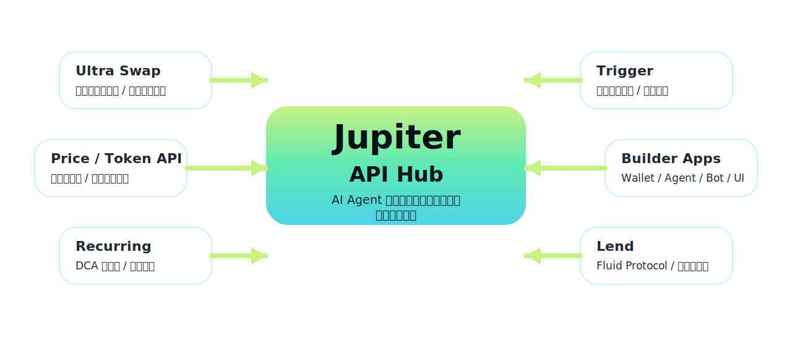
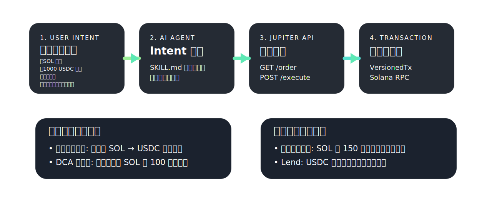
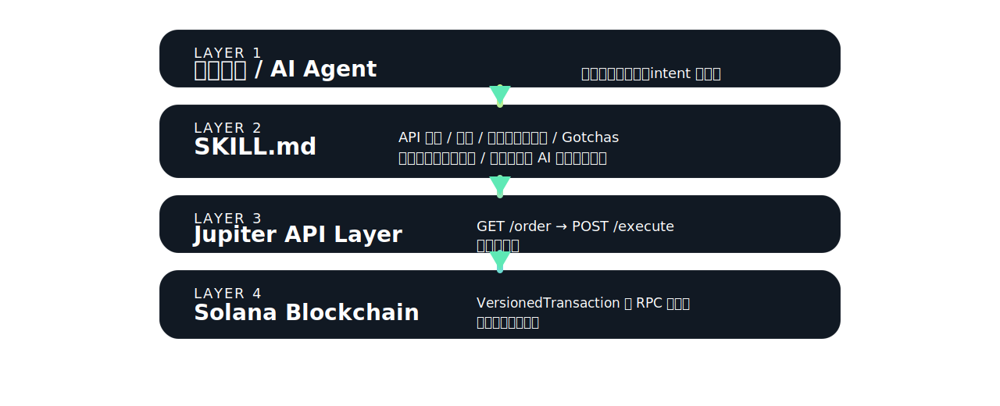

<!-- _class: lead -->
<!-- header: "" -->

# Jupiter Agent Skills で拓く

## AI × DeFi の最前線

### ハッカソンで使える Ultra Swap 最小実装 & エラーハンドリング完全ガイド

<div class="hero-meta">
  <div>
    <p class="text-2xl font-semibold mb-3">Clawathon Tokyo Edition 2026</p>
    <p class="text-xl text-gray-300">Presented by SuzuPay × Jupiter</p>
  </div>
  <div class="text-right">
    <p class="text-lg text-gray-300">5 min intro + demos + hands-on + gotchas</p>
  </div>
</div>

---

<!-- header: Opening -->

## 本日のアジェンダ

<table class="compact-table">
  <thead>
    <tr>
      <th>Part</th>
      <th>Time</th>
      <th>Topic</th>
      <th>What you'll get</th>
    </tr>
  </thead>
  <tbody>
    <tr><td>①</td><td>5分</td><td>オープニング</td><td>ゴール・アジェンダ / Jupiter エコシステム概要</td></tr>
    <tr><td>②</td><td>10分</td><td>【デモ先行】AI × DeFi の世界</td><td>AI エージェントによる自律トレード実演 / Why Jupiter?</td></tr>
    <tr><td>③</td><td>10分</td><td>DeFi 課題解決 & Agent Skills アーキテクチャ</td><td>複雑な UX を AI が解決 / <code>SKILL.md</code> の仕組み</td></tr>
    <tr><td>④</td><td>20分</td><td>【ハンズオン】最小実装</td><td>Ultra Swap / DCA 自動化 / Lend 組み込み</td></tr>
    <tr><td>⑤</td><td>10分</td><td>エラーハンドリング & Gotchas</td><td>TTL・冪等性・Rate Limit・リトライ戦略</td></tr>
    <tr><td>⑥</td><td>5分</td><td>Q&A・クロージング</td><td>質疑応答 / SuzuPay & Jupiter からの案内</td></tr>
  </tbody>
</table>

---

<!-- header: Opening -->

## Jupiter エコシステム: 開発者にとっての立ち位置



---

<!-- _class: section-divider -->
<!-- header: "" -->

# SECTION 1

## 【デモ先行】

### Jupiter Agent Skills が実現する AI × DeFi の世界

<p class="mt-10 text-2xl text-gray-300">10 min</p>

---

<!-- _class: flow-slide -->
<!-- header: Section 1 -->

## 【実演デモ】自然言語から Jupiter API が動く世界



---

<!-- header: Section 1 -->

## デモ

<div class="h-full flex items-center justify-center pt-12">
  <div class="rounded-3xl border border-dashed border-white/30 bg-black/15 px-14 py-16 text-center max-w-4xl">
    <p class="text-sm uppercase tracking-[0.3em] text-gray-400 mb-4">Live Demo Placeholder</p>
    <p class="text-4xl font-semibold mb-4">自然言語から Jupiter API までの実演</p>
    <p class="text-2xl text-gray-300">このスライドは、当日デモまたは画面共有を差し込むための間スライドとして維持します。</p>
  </div>
</div>

---

<!-- header: Section 1 -->

## Why Jupiter? ビルダー視点の 3 つの理由

<div class="grid grid-cols-3 gap-4 mt-6">
  <div class="rounded-2xl border border-white/10 bg-white/5 p-5">
    <p class="text-5xl font-semibold text-lime-200 mb-4">01</p>
    <p class="text-2xl font-semibold mb-3">流動性の集約</p>
    <ul class="text-lg">
      <li>Metis / JupiterZ / DFlow / OKX の 4 ルーターが競合</li>
      <li>1 API コールで最良レートを自動選択</li>
      <li>Split `order` / `execute` でリアルタイム流動性を取得</li>
    </ul>
  </div>
  <div class="rounded-2xl border border-white/10 bg-white/5 p-5">
    <p class="text-5xl font-semibold text-lime-200 mb-4">02</p>
    <p class="text-2xl font-semibold mb-3">API の圧倒的な使いやすさ</p>
    <ul class="text-lg">
      <li>RESTful 設計: `GET /order` → `POST /execute` の 2 ステップ</li>
      <li>条件次第でガスレス対応</li>
      <li>TypeScript / Python SDK で即日統合可能</li>
    </ul>
  </div>
  <div class="rounded-2xl border border-white/10 bg-white/5 p-5">
    <p class="text-5xl font-semibold text-lime-200 mb-4">03</p>
    <p class="text-2xl font-semibold mb-3">Agent Skills との相性</p>
    <ul class="text-lg">
      <li>`SKILL.md` で API 仕様を AI 向けにパッケージング</li>
      <li>自然言語の intent を構造化パラメータへ変換</li>
      <li>ハッカソンで数時間以内に動くものを作りやすい</li>
    </ul>
  </div>
</div>

---

<!-- _class: section-divider -->
<!-- header: "" -->

# SECTION 2

## DeFi の課題解決と Agent Skills アーキテクチャ

<p class="mt-10 text-2xl text-gray-300">10 min</p>

---

<!-- _class: architecture-slide -->
<!-- header: Section 2 -->

## Agent Skills の仕組み: `SKILL.md` が AI と API をつなぐ



<div class="card-grid-3">
  <div class="glass-card">
    <div class="kicker">SKILL.md に含まれる情報</div>
    <h4>接続の前提</h4>
    <p>エンドポイント一覧 / 認証方法（<code>x-api-key</code>）</p>
  </div>
  <div class="glass-card">
    <div class="kicker">Failure Handling</div>
    <h4>落とし穴の先回り</h4>
    <p>エラーコード対応表 / Gotchas（罠）</p>
  </div>
  <div class="glass-card">
    <div class="kicker">Execution</div>
    <h4>実装ガイド</h4>
    <p>リトライ戦略 / コード例</p>
  </div>
</div>

---

<!-- _class: section-divider -->
<!-- header: "" -->

# SECTION 3

## 【ハンズオン】ハッカソンですぐ使える最小実装

<p class="mt-10 text-2xl text-gray-300">20 min — Ultra Swap / DCA / Lend</p>

---

<!-- _class: code-triple -->
<!-- header: Section 3 -->

## Ultra Swap 最小構成: 3 ステップで動かす

<div class="note-banner">署名後の TTL は約 2 分。同じ <code>requestId</code> + <code>signedTransaction</code> なら冪等に再送できます。</div>

### Step 1
#### クォート取得
```ts
const res = await fetch(
  `${BASE}/swap/v2/order?` +
  `inputMint=${SOL}&` +
  `outputMint=${USDC}&` +
  `amount=1000000000&` +
  `taker=${wallet.publicKey}`,
  { headers }
);
const { transaction, requestId } =
  await res.json();
```

### Step 2
#### 署名
```ts
const tx = VersionedTransaction
  .deserialize(
    Buffer.from(transaction, "base64")
  );
tx.sign([wallet]);
const signed = Buffer
  .from(tx.serialize())
  .toString("base64");
```

### Step 3
#### 実行
```ts
const result = await fetch(
  `${BASE}/swap/v2/execute`,
  {
    method: "POST",
    headers,
    body: JSON.stringify({
      signedTransaction: signed,
      requestId
    })
  }
);
```

---

<!-- _class: code-double -->
<!-- header: Section 3 -->

## 拡張ユースケース: DCA 自動化 & Lend（貸借）

<div class="note-banner"><span class="emoji-label"><span>🔑</span><span><code>x-api-key</code> ヘッダーは全エンドポイント必須。<code>portal.jup.ag</code> で API キーを取得します。</span></span></div>

### <span class="emoji-label"><span>📅</span><span>Recurring（DCA: 毎日 / 毎週の積立）</span></span>
```json
{
  "user": "<wallet>",
  "inputMint": "USDC_MINT",
  "outputMint": "SOL_MINT",
  "inAmount": "100000000",
  "inAmountPerCycle": "10000000",
  "cycleSecondsApart": 86400,
  "numberOfTrades": 10,
  "startAt": null
}
```
<div class="note-banner">Trigger も同様に <code>POST /trigger/v1/createOrder</code> で価格条件を登録します。</div>

### <span class="emoji-label"><span>🏦</span><span>Lend（Fluid Protocol — 預け入れ）</span></span>
```txt
GET  /lend/v1/markets
POST /lend/v1/deposit
{
  "wallet": "<wallet>",
  "mint": "USDC_MINT",
  "amount": "1000000000"
}
GET /lend/v1/positions?wallet=<wallet>
POST /lend/v1/borrow
```
<div class="note-banner">APY はマーケットにより変動。担保率と清算リスクを前提に UI を設計します。</div>

---

<!-- _class: section-divider -->
<!-- header: "" -->

# SECTION 4

## ハッカソンを勝ち抜くためのエラーハンドリング & Gotchas

<p class="mt-10 text-2xl text-gray-300">10 min — 陥りやすい罠とリトライ戦略</p>

---

<!-- _class: gotchas-slide -->
<!-- header: Section 4 -->

## Gotchas（陥りやすい罠）& エラーコード対応表

<div class="card-grid-2">
  <div class="glass-card">
    <h4><span class="emoji-label"><span>⚠</span><span>Gotchas（罠リスト）</span></span></h4>
    <ul>
      <li>TTL: 署名済み Tx は約 2 分で失効。切れたら再クォート。</li>
      <li>冪等性: 同じ <code>requestId</code> + signedTx なら 2 分以内は再送可。</li>
      <li>Rate Limit: 基本は 50 req / 10 s。<code>Retry-After</code> を確認。</li>
      <li>署名エラー <code>-1003</code>: 全必要署名者が揃っているか確認。</li>
      <li><code>/build</code> と <code>/execute</code> の混用は不可。</li>
      <li>payer 指定時はルートが Metis に限定される。</li>
    </ul>
  </div>
  <div class="glass-card">
    <h4><span class="emoji-label"><span>🔴</span><span>主要エラーコードと対処</span></span></h4>
    <table class="compact-table tiny-table">
      <thead>
        <tr><th>コード</th><th>分類</th><th>対処法</th><th>Retry</th></tr>
      </thead>
      <tbody>
        <tr><td>-1</td><td>オーダー失効</td><td>再クォート</td><td>✓</td></tr>
        <tr><td>-1000</td><td>ランディング失敗</td><td>パラメータ調整で再試行</td><td>✓</td></tr>
        <tr><td>-1001</td><td>不明エラー</td><td>指数バックオフで再試行</td><td>✓</td></tr>
        <tr><td>-1003</td><td>署名不足</td><td>全署名者を確認</td><td>✗</td></tr>
        <tr><td>-1004</td><td>Blockhash 失効</td><td>再クォート</td><td>✓</td></tr>
        <tr><td>-2003</td><td>クォート失効</td><td>再クォート</td><td>✓</td></tr>
        <tr><td>429</td><td>Rate Limit 超過</td><td><code>Retry-After</code> 後に再試行</td><td>✓</td></tr>
      </tbody>
    </table>
  </div>
</div>

---

<!-- _class: retry-slide -->
<!-- header: Section 4 -->

## リトライ戦略 & ミニマム本番投入チェックリスト

### 指数バックオフ + ジッター（実装例）
```ts
async function withRetry(fn, maxAttempts = 3) {
  for (let i = 0; i < maxAttempts; i += 1) {
    try {
      return await fn();
    } catch (err) {
      const retryable = [
        -1, -1000, -1001, -1004,
        -2000, -2001, -2003, 429
      ].includes(err.code);
      if (!retryable || i === maxAttempts - 1) throw err;
      const base = Math.pow(2, i) * 1000;
      const jitter = Math.random() * 1000;
      await sleep(base + jitter);
      if ([-1, -1004, -2003].includes(err.code)) await reQuote();
    }
  }
}
```
<div class="note-banner">タイムアウト設定: クォート 5 秒 / 実行 30 秒 / 全体 60 秒</div>

<div class="glass-card">
  <h4><span class="emoji-label"><span>✅</span><span>ミニマム本番投入チェックリスト</span></span></h4>
  <ul>
    <li>API キー検証: 起動時に <code>x-api-key</code> 未設定なら即 fail fast</li>
    <li>タイムアウト設定: 全 <code>fetch</code> に <code>AbortController</code> を追加</li>
    <li>リトライ分類: retryable / non-retryable をエラーコードで判定</li>
    <li><code>requestId</code> ロギング: 全 API コールで requestId + status を残す</li>
    <li>冪等性の確認: 再送前に同 Tx が確定していないか確認</li>
    <li>Slippage 上限設定: アプリ設定から最大値を強制</li>
    <li>残高・アドレス検証: 実行前に mint アドレスと残高を検証</li>
  </ul>
</div>

---

<!-- header: Closing -->

## Q&A・クロージング

<div class="resource-grid">
  <div class="resource-card">
    <h4><span class="emoji-label"><span>💬</span><span>質疑応答</span></span></h4>
    <ul>
      <li>Jupiter API 全般</li>
      <li>Agent Skills 実装</li>
      <li>ハッカソンアイデア相談</li>
      <li>エラーデバッグ支援</li>
    </ul>
  </div>
  <div class="resource-card">
    <h4><span class="emoji-label"><span>🔗</span><span>リソース</span></span></h4>
    <ul>
      <li><code>dev.jup.ag</code> 公式ドキュメント</li>
      <li><code>portal.jup.ag</code> API キー取得</li>
      <li><code>github.com/jup-ag/agent-skills</code></li>
      <li><code>discord.gg/jupiter</code></li>
    </ul>
  </div>
  <div class="resource-card">
    <h4><span class="emoji-label"><span>🚀</span><span>Clawathon Tokyo</span></span></h4>
    <ul>
      <li>テーマ: AI × DeFi</li>
      <li>Jupiter スポンサー賞あり</li>
      <li>SuzuPay コラボトラック</li>
      <li>詳細はアンケートで通知</li>
    </ul>
  </div>
</div>

<div class="closing-note">
  <p><span class="emoji-label"><span>🙏</span><span>ご参加ありがとうございました</span></span></p>
  <p>Build something amazing on Jupiter!</p>
</div>
